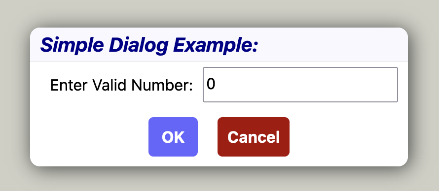

# Dialog Component
A [NextJS](https://nextjs.org/) component package for simplifying and standardizing the use of user dialog in NextJS apps.

## Installation
Use `npm` to install as a library:
```
$ npm i hauke5/dialog@latest
``` 

Or use `npx` to create and start a standalone NextJS application with an example for using `<Dialog>`:
```
$ npx hauke5/dialog@latest
```
This will start a next development server.
Point a browser to http://localhost:3010/example to run the app.

## Usage

### Defining a Dialog
A dialog is defined by the `DialogConfig` structure, consisting of 
- a leading title to explain the purpose of the dialog to the user
- a list of dialog items, each consisting of a `DialogItemConfig` structure
- and a list of buttons to perform actions

A `Cancel` button will be automatically added by the component

A simple dialog configuration might look like this:
```typescript
{
   title: 'Simple Dialog Example:',
   elements:[
      { 'Enter Valid Number': { type:'number', initial: 0 }},
   ],
   buttons:[
      { OK: {}}, 
   ]
}
```


The keys for items and buttons are by default used as their labels. Alternatively, an optional `label` field can be specified:
```typescript
{
   title: 'Example:',
   elements:[
      { ValidItem: { type:'number', initial: 0, label:'Enter Valid Number'}},
   ],
   buttons:[
      { OkButton: { label:'OK'}}, 
   ]
}
```


## Integrating Dialogs into Components
Add a `<Dialog>` component at the end of React nodes in your component. It takes a callback function through which it provides an `open` function that can be stored in a `Ref`. `<Dialog>` internally uses the html `<dialog>` tag, so stays invisible until opened, which happens here in `runDialog` when it is triggered by clicking on the `Open Dialog` button.

To open the dialog, call the `open` function provided by `<Dialog>` with the dialog content structure. The asynchronously process the dialog result. It provides 
- the key of the button pressed (or, in some cases, an ID for some predefined dialog action sucj as double-clicking a file in a file selector field)
- a `DialogItemResult` structure for each item key, providing the `type` and current `value` of the item, as well as a boolean `isDefault` that is `true` if the user has directly manipulated the item, and `false` if the value is either the `initial` value or the result of a `sideEffect`. 
```typescript
function Component() {
   const openDialog  = useRef<OpenDialog>()

   return <div>
      <button onClick={runDialog}>Open Dialog</button>
      <Dialog open={open=>openDialog.current=open} />
   </div>

   async function runDialog() {
      if (openDialog.current) {
         // open the dialog with `dialogConfog` as content
         const result = await openDialog.current(dialogConfig)
         // process the result action and item values
         if (result.actionName==='Ok') {
            const number = result.items['Enter Valid Number:'].value as number
            ...
         }
      }
   } 
}
```

## Defining Side effects
Side effects are actions performed on the elements of a dialog box while the user manipulates them. For example, the visual state or the initial value of a dialog element can be made to change depending on the value of one or more other elements. 

Two types of side effects are currently available:

### Disabling Buttons
Add a `disable` callback to a button configuration to tell the `<Dialog>` whether the button should be active or disabled.
The following example disables the `OkButton` if the `ValidItem` value is `0`
```typescript
   ...
   buttons:[
      {OkButton: {disable:isOKDisabled}}, 
   ]
   ...

function isOKDisabled(values:ItemsLiteral) {
   return values.ValidItem.value===0
}
```

### Item SideEffects
Add a `sideEffect` callback to an item configuration to have user-changes to the item value trigger updates to other items.
The callback will receive the current `value` of the item, as well as a reference to the set of all items.
In the example below, `validItemChange` will be called each time the `ValidItem` number field changes. It will change the `TextItem` field, if it hasn't been explicitely set by the user, to read `invalid number` if the number value is `0`, and `valid number` otherwise.
```typescript
{
   title: 'Example:',
   elements:[
      { ValidItem: { type:'number', initial: 0, label:'Enter Valid Number:', sideEffect:validItemChange}},
      { TextItem:  { type:'text',   initial: 'invalid', label:'Number Comment:'}},
   ],
   buttons:[
      { OkButton: { label:'OK'}}, 
   ]
}

function validItemChange(value:number, items:ItemsLiteral):{[key:string]:any} {
   return items.TextItem.isDefault
      ? {TextItem: value!==0? 'valid number' : 'invalid number' }
      : {}
}
```