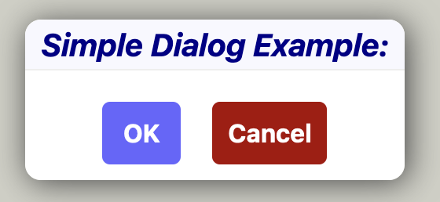
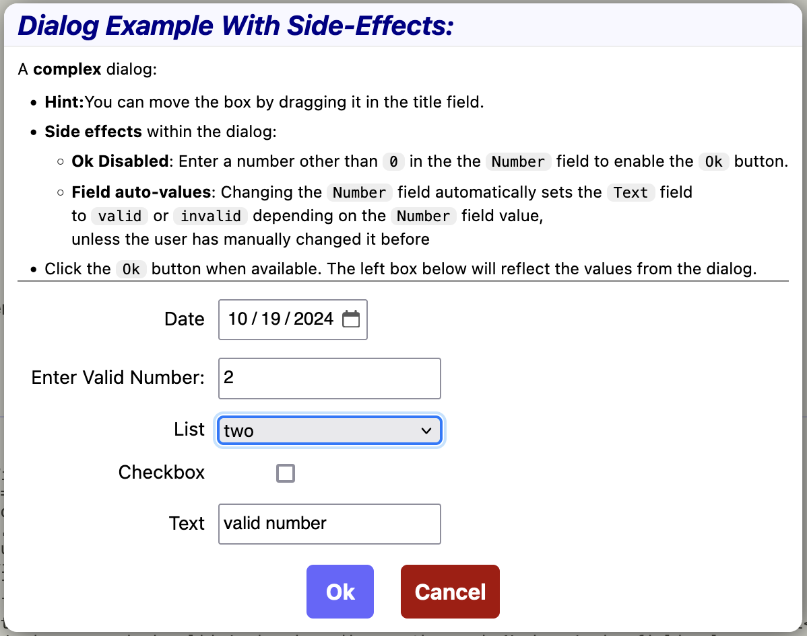

# Dialog Component
A [NextJS](https://nextjs.org/) component package for simplifying and standardizing the use of user dialog in NextJS apps. Supported features include:
- movable modal dialog box
- fully typed interface, with typing support in the dialog result for accessing items and buttons by name.
- configurable side effects: allow changes to an items value effect the values of other items or the the disabledness of buttons

## Installation
Either 1) Use `npx` to run an example of the dialog component in a NextJS app:
```
$ npx hauke5/dialogexample
```
This will start a next development server.
Point a browser to http://localhost:3001/dialog to run the app.


Or 2) use `git clone` to install the component along with a usage example app in NextJS:
```
$ git clone https://github.com/Hauke5/DialogExample.git
``` 
This will install the required typescript components and support libraries, along with the usage example in `app/dialog/DialogExample.tsx`
To run the example manually, follow the `git clone` command with:
```
cd DialogExample  # change into the newly created folder
npm i             # install dependencies
npm run dev       # run the development server
```
Again, point a browser to http://localhost:3001/dialog to run the app.

## Usage

### Defining a Dialog
A dialog is defined by the `DialogConfig` structure, consisting of 
- a leading title to explain the purpose of the dialog to the user
- an optional description, accepting a ReactNode
- an optional list of dialog items, each consisting of a `DialogItemConfig` structure
- and a list of buttons to perform actions.

If not provided by the `DialogConfig`, A `Cancel` button will be automatically added by the component.

A simplest version of a dialog configuration might look like this:
```typescript
{
   title: 'Simple Dialog Example:',
   buttons:[
      { id:'OK'}, 
   ]
}
```


The `ids` for items and buttons are by default used as their labels. Alternatively, an optional `label` field can be specified:
```typescript
{
   title: 'Example:',
   items:[
      { id:'ValidItem', type:'number', initial: 0, label:'Enter Valid Number'}},
   ],
   buttons:[
      { id:'OkButton', label:'OK'}}, 
   ]
}
```


## Integrating Dialogs into Components
Add a `<Dialog>` component at the end of React nodes in your component. It takes a callback function through which it provides an `open` function that can be stored in a `Ref`. `<Dialog>` internally uses the html `<dialog>` tag, so stays invisible until opened, which happens below in `runDialog` when it is triggered by clicking on the `Open Dialog` button.

To open the dialog in code, call the `open` function provided by `<Dialog>` with the dialog content structure and await the result. It provides 
- the `actionName`, i.e. id of the button pressed (or, in some cases, an ID for some predefined dialog action such as double-clicking a file in a file selector field)
- an `items` object containing each of the item IDs, providing 
    - the `type` of the item's value
    - the current `value` of the item, 
    - the `isDefault` status: `false` if the user has directly manipulated the item, and `true` if the value is either the `initial` value or the result of a `sideEffect`. 
```typescript
function Component() {
   const openDialog  = useRef<OpenDialog>()

   return <div>
      <button onClick={runDialog}>Open Dialog</button>
      <Dialog open={open=>openDialog.current=open} />
   </div>

   async function runDialog() {
      if (openDialog.current) {
         // open the dialog with `dialogConfog` as content
         const result = await openDialog.current({
            title: 'Example:',
            items:[
               { id:'ValidItem', type:'number', initial: 0, label:'Enter Valid Number'}},
            ],
            buttons:[
               { id:'OkButton', label:'OK'}}, 
            ]
         })
         // process the result action and item values
         if (result.actionName==='Ok') {
            const numberItem = result.items.ValidItem
            const number     = numberItem.value as number
            const isDefault  = numberItem.isDefault
            ...
         }
      }
   } 
}
```

## Defining Side effects
Side effects are actions performed on the elements of a dialog box while the user manipulates them. For example, the disabled state of a button or the initial value of a dialog element can be made to change depending on the value of one or more other elements. 

Two types of side effects are available:

### Disabling Buttons
Add a `disable` function to a button configuration to tell the `<Dialog>` whether the button should be active or disabled. The function will receive the same `items` object as is returned when the dialog closes
The following example disables the `OkButton` if the `ValidItem` value is `0`
```typescript
   ...
   buttons:[
      {id:'OkButton', disable:(items) items.ValidItem.value===0}, 
   ]
   ...
```

### Item SideEffects
Add a `sideEffect` callback to an item configuration to have user-changes to the item value trigger updates to other items.
The callback will receive the current `value` of the item, as well as a reference to the set of all items.
In the example below, a sideEffect will be called each time the `ValidItem` number field changes. It will change the `TextItem` field, if it hasn't been explicitely set by the user, to read `invalid number` if the number value is `0`, and `valid number` otherwise.
```typescript
{
   title: 'Example:',
   elements:[
      { id:'ValidItem', type:'number', initial: 0, label:'Enter Valid Number:', 
         sideEffect:(value, items)=>items.TextItem.isDefault
            ? {TextItem: value!==0? 'valid number' : 'invalid number' }
            : {}
      }},
      { id:'TextItem', type:'text',   initial: 'invalid', label:'Number Comment:'}},
   ],
   buttons:[
      { id:'OkButton', label:'OK'}}, 
   ]
}
```

## Complex Example:
```typescript
{
   title: 'Dialog Example With Side-Effects:',
   description:  <div style={{borderBottom:"1px solid gray"}}>
      A <b>complex</b> dialog:
      <ul className={styles.instructions}>
         <li><b>Hint:</b>You can move the box by dragging it in the title field.</li>
         <li>Side effects within the dialog:</li>
         <ul className={styles.instructions}>
            <li><b>Ok Disabled</b>: Enter a number other than <code>0</code> in the the <code>Number</code> field to enable the <code>Ok</code> button.</li>
            <li><b>Field auto-values</b>:Changing the <code>Number</code> field automatically sets the <code>Text</code> field 
            to <code>valid</code> or <code>invalid</code> depending on the <code>Number</code> field value, 
            unless the user has manually changed it before</li>
         </ul>
         <li>Click the <code>Ok</code> button when available. 
         The left box below will reflect the values from the dialog.</li>
      </ul>
   </div>,
   items:[
      {id:'Date',      type:'date',   initial: new Date() },
      {id:'Number',    type:'number', initial: 0,   label:'Enter Valid Number:',  sideEffect:(value:number, items) => 
         items.Text.isDefault
            ? {Text:(value !== 0)? 'valid number' : 'invalid number' }
            : {}
      },
      {id:'Text',      type:'text',   initial: 'invalid', list:textFieldHistory},
      {id:'Checkbox',  type:'boolean',initial: false},
      {id:'List',      type:'select', initial: 'two',     list:['one', 'two', 'three']},
   ],
   buttons:[
      {id:'Ok', disable:(values) => values.Number.value===0}, 
   ]
}
```

